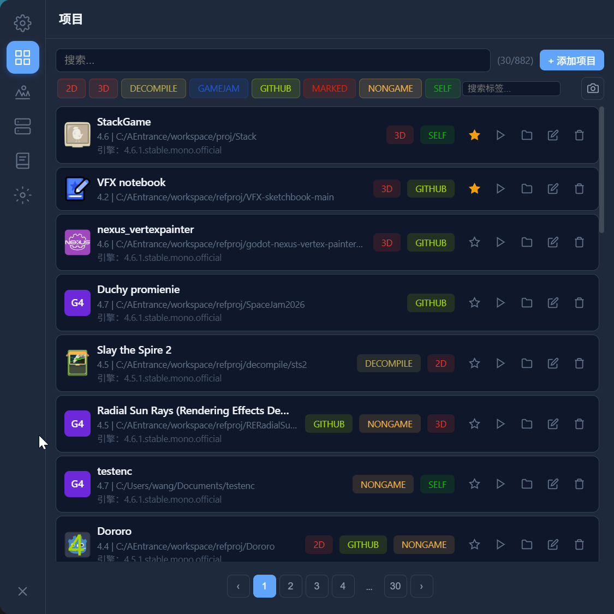
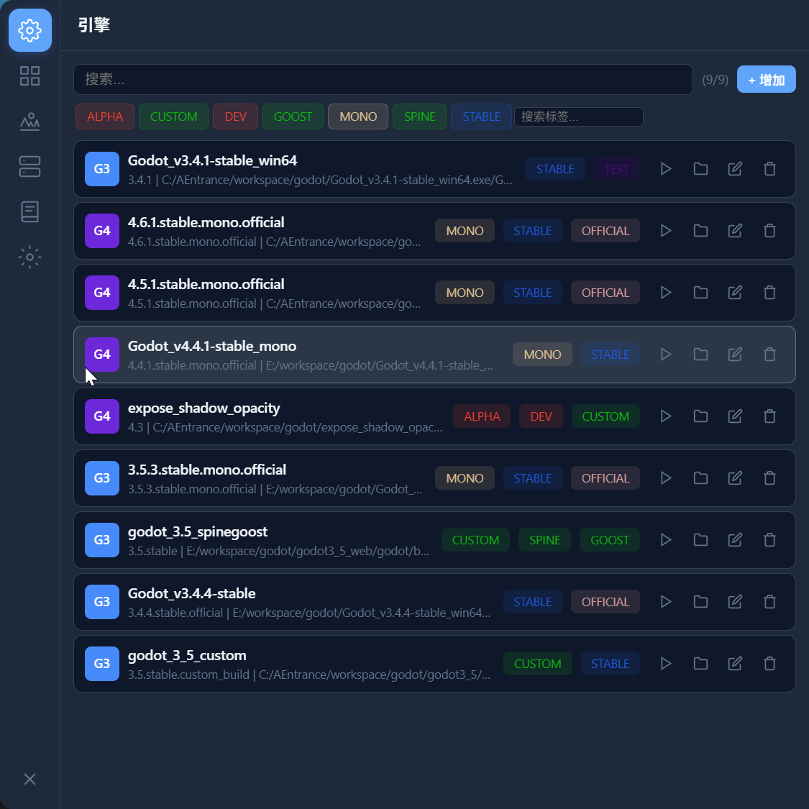
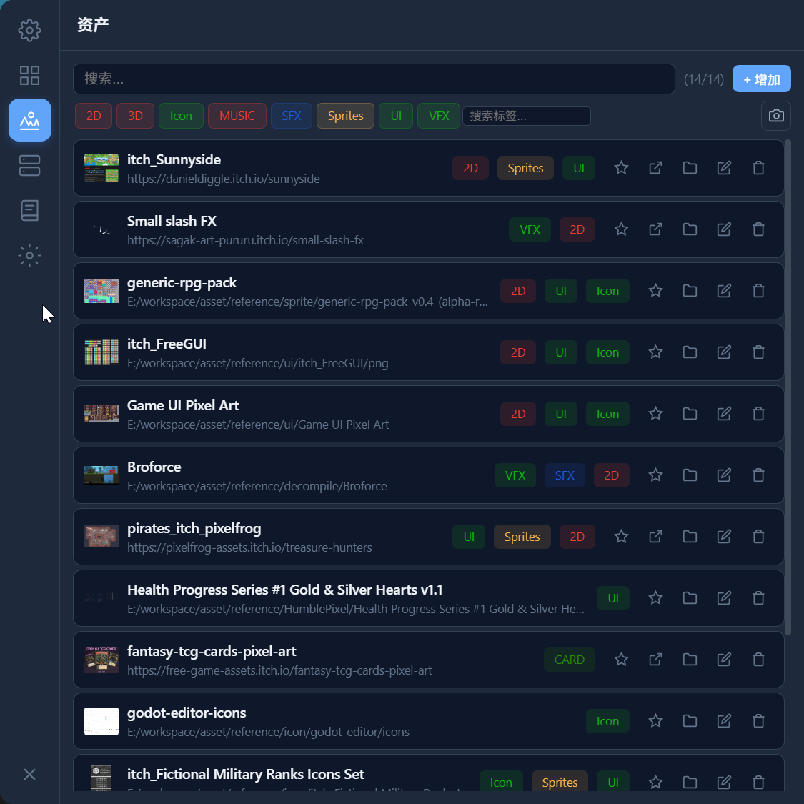
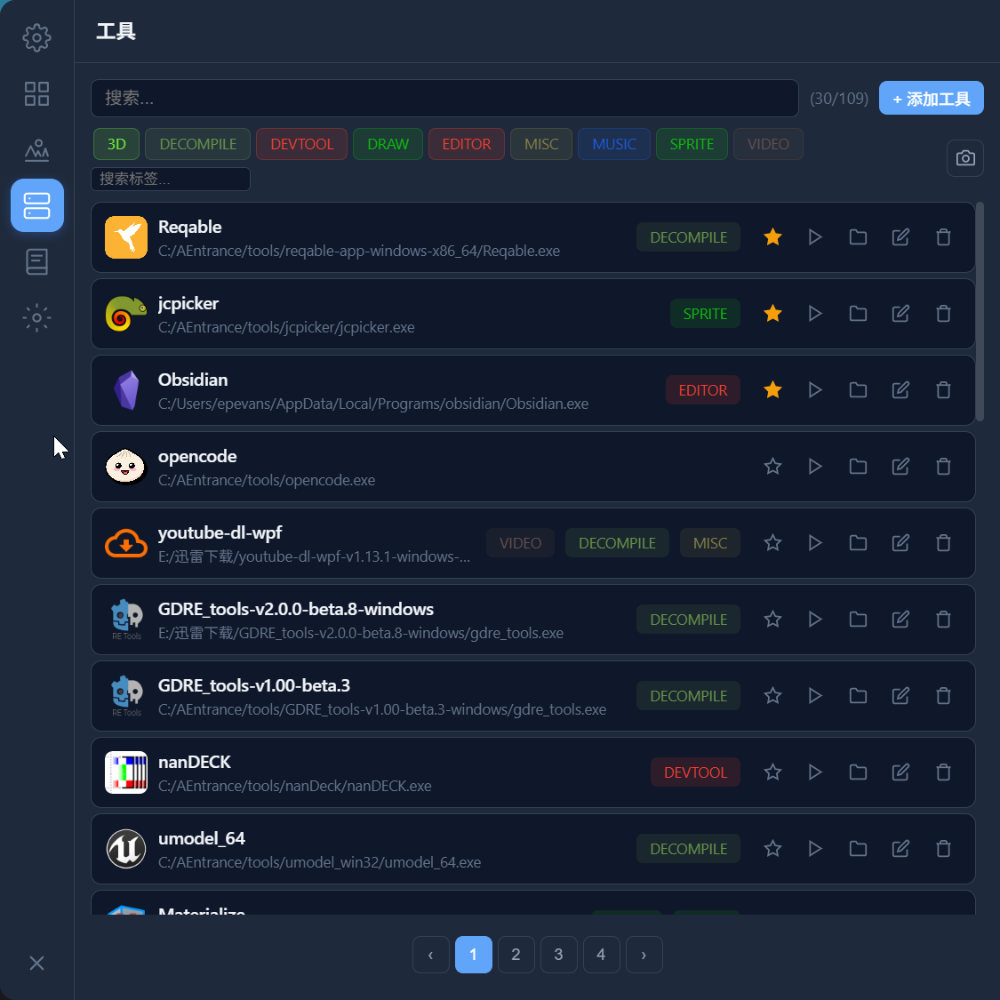
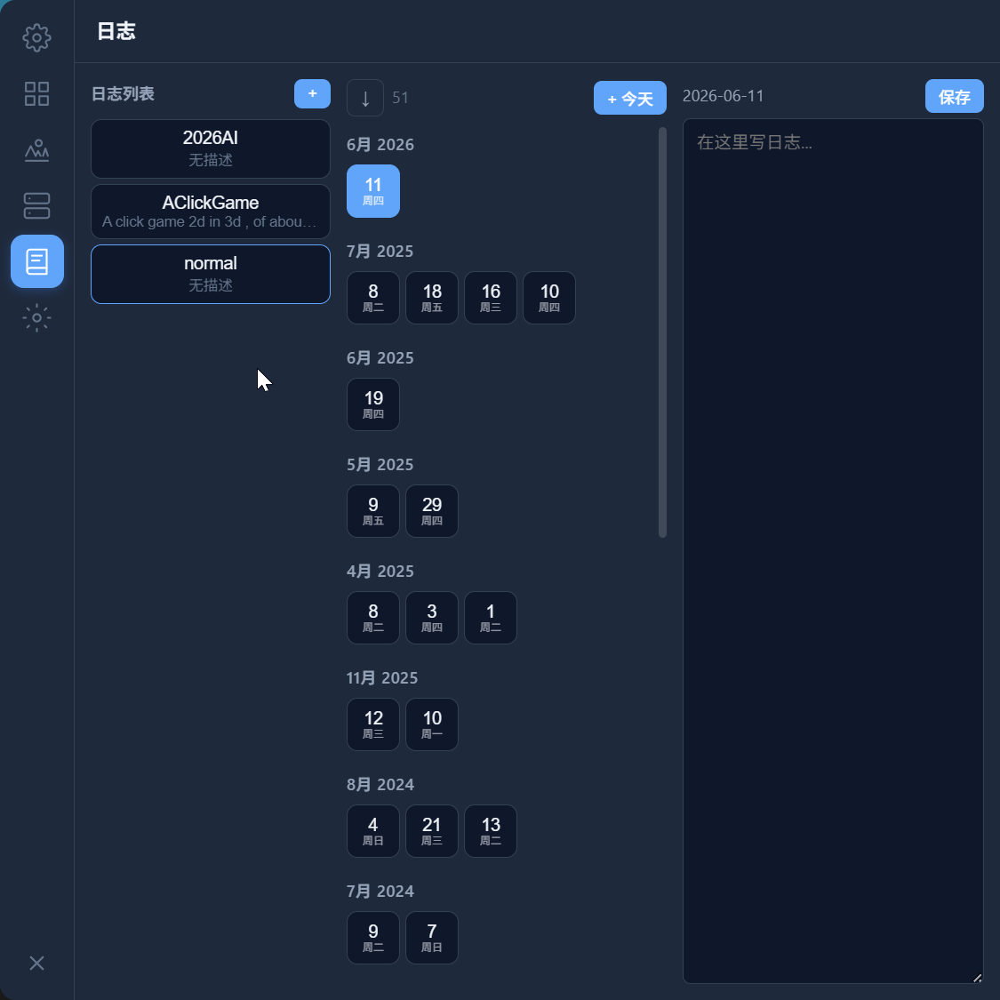
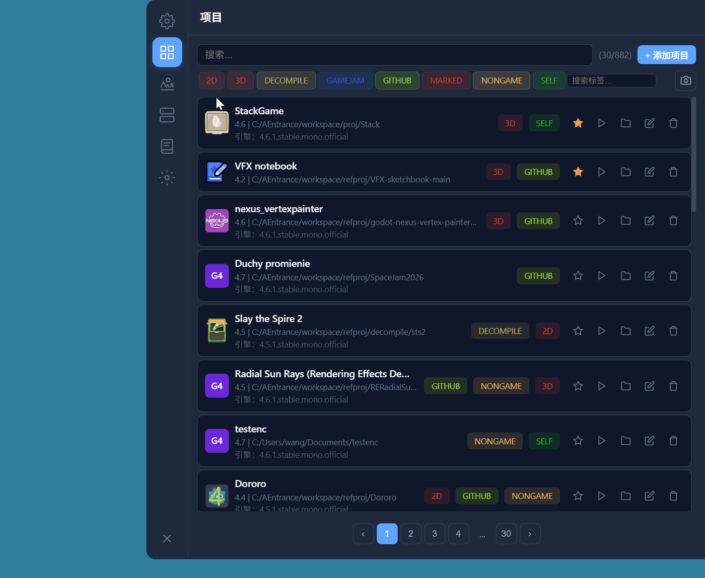
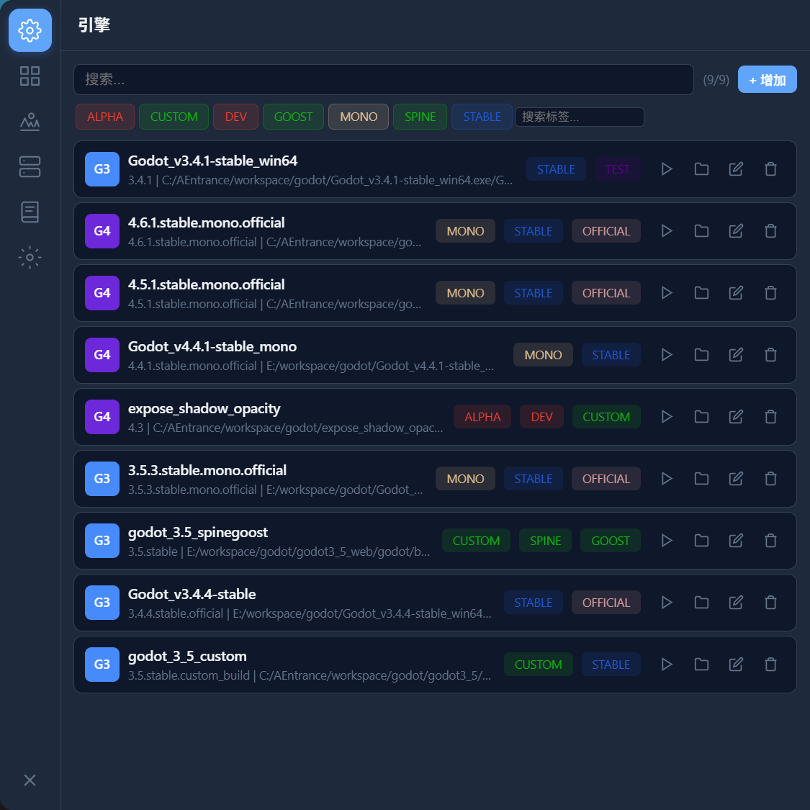

# GodotMemory

<p align="center">
  
</p>

Godot Engine / Tool / Asset management tool — a floating bubble launcher that provides quick access to engine monitors, project management, asset browsing, tools, and diary notes.

Built with [Tauri 2](https://v2.tauri.app), React, TypeScript, and Rust.

## Screenshots









## Features

- **Engine Monitor** — real-time memory/resource usage for Godot Editor
- **Project Manager** — browse and launch Godot projects
- **Asset Browser** — browse, search, and open assets
- **Toolbox** — quick access to common Godot tools
- **Diary** — note-taking panel for development ideas
- **Floating Bubble** — click to expand, drag to move, always-on-top

## Development

### Prerequisites

- [Node.js](https://nodejs.org) 20+
- [Rust](https://rustup.rs) 1.77+
- [Tauri 2 system dependencies](https://v2.tauri.app/start/prerequisites/)

### Setup

```bash
npm install
npm run tauri dev
```

### Build

```bash
npm run tauri build
```

Output bundles will be in `src-tauri/target/release/bundle/`.

## License

[MIT](LICENSE)
